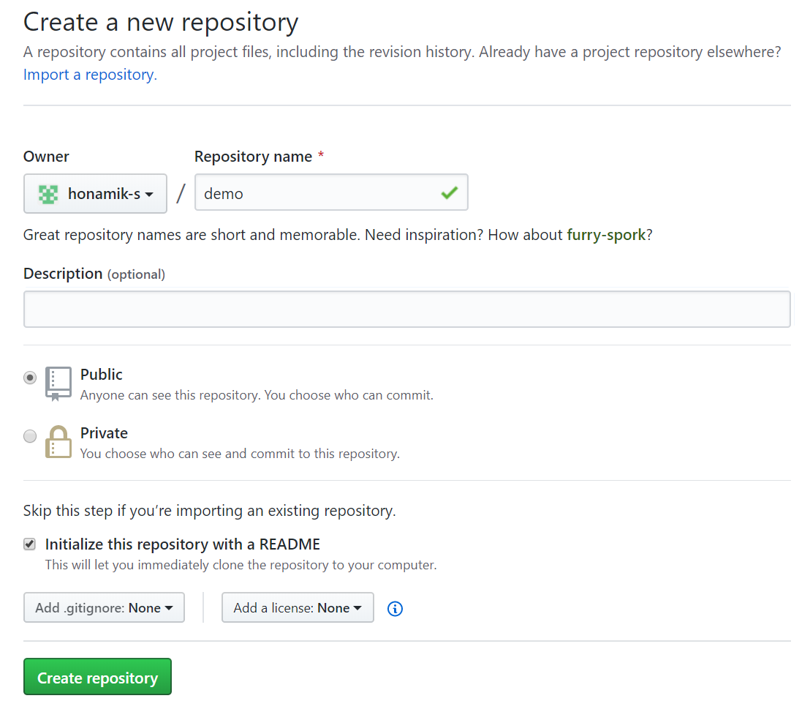
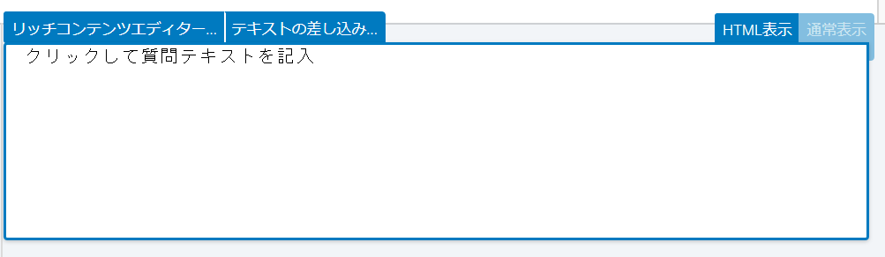

```{r setup, echo=FALSE, cache=FALSE}
library(knitr)
library(rmdformats)

## Global options
options(max.print="75")
opts_chunk$set(echo=TRUE,
	             cache=TRUE,
               prompt=FALSE,
               tidy=TRUE,
               comment=NA,
               message=FALSE,
               warning=FALSE)
opts_knit$set(width=75)
```


QualtricsでjsPsychの実験を埋め込んで実行するためのコードなどを紹介します。[こちらのページ](https://kywch.github.io/jsPsych-in-Qualtrics/)をおおいに参考にしました。


# GitHubのレポジトリを作る

今回はGitHubのレポジトリに実験ファイルを置いて利用するので、GitHubにレポジトリを作る必要があります。[こちら](https://help.github.com/ja/github/getting-started-with-github/create-a-repo)を見ると、作り方がわかると思います。

GitHubを使わない方法もあるはずですが、私が把握していないので今回は扱いません。

{width=500px}


# jsPsychの実験をGitHubに置く


jsPsychフォルダ、実験で使う画像のフォルダ、実験ファイル (html) を準備します。今回使っている実験は、jsPsychの公式サイトで公開されている反応時間課題チュートリアルのものです。``experiment.html``の中身はこんな感じ。


<details><summary>サンプルコード</summary><div>

```
<!DOCTYPE html>
<html>
    <head>
        <title>My experiment</title>
        <script src="jspsych-6.1.0/jspsych.js"></script>
        <script src="jspsych-6.1.0/plugins/jspsych-html-keyboard-response.js"></script>
        <script src="jspsych-6.1.0/plugins/jspsych-image-keyboard-response.js"></script>
        <link href="jspsych-6.1.0/css/jspsych.css" rel="stylesheet" type="text/css"></link>
    </head>
    <body></body>
    <script>

    /* create timeline */
    var timeline = [];

    /* define welcome message trial */
    var welcome = {
      type: "html-keyboard-response",
      stimulus: "スペースキーを押すと実験を開始できます。"
    };
    timeline.push(welcome);

    /* define instructions trial */
    var instructions = {
      type: "html-keyboard-response",
      stimulus: "<p>この実験では画面の中央に円が表示されます。 </p>" +
          "<p>もし円が <strong>青なら</strong>、Fキーを押してください。</p>" +
          "<p>もし円が <strong>オレンジなら</strong>、Jキーを押してください。</p>" +
          "<div style='width: 700px;'>"+
          "<div style='float: left;'></img>" +
          "<p class='small'><strong>Fキーを押してください</strong></p></div>" +
          "<div class='float: right;'></img>" +
          "<p class='small'><strong>Jキーを押してください</strong></p></div>" +
          "</div>"+
          "<p>スペースキーを押すと実験を開始できます。</p>",
      post_trial_gap: 2000
    };
    timeline.push(instructions);

    /* test trials */
    var test_stimuli = [
      { stimulus: "img/blue.png", data: {test_part: 'test', correct_response: 'f'}},
      { stimulus: "img/orange.png", data: {test_part: 'test', correct_response: 'j'}}
    ];

    var fixation = {
      type: 'html-keyboard-response',
      stimulus: '<div style="font-size:60px;">+</div>',
      choices: jsPsych.NO_KEYS,
      trial_duration: function(){
        return jsPsych.randomization.sampleWithoutReplacement([250, 500, 750, 1000, 1250, 1500, 1750, 2000], 1)[0];
        },
      data: {test_part: 'fixation'}
    }

    var test = {
      type: "image-keyboard-response",
      stimulus: jsPsych.timelineVariable('stimulus'),
      choices: ['f', 'j'],
      data: jsPsych.timelineVariable('data'),
      on_finish: function(data){
        data.correct = data.key_press == jsPsych.pluginAPI.convertKeyCharacterToKeyCode(data.correct_response);
        }
    }

    var test_procedure = {
      timeline: [fixation, test],
      timeline_variables: test_stimuli,
      randomize_order: true,
      repetitions: 5
    }

    timeline.push(test_procedure);


    /* start the experiment */
    jsPsych.init({
      timeline: timeline,
      on_finish: function() {
        jsPsych.data.displayData();
        }
    });


    </script>
</html>


```
</div></details>
<br><br>

これらを作成したGitHubレポジトリにアップロードします。「Commit change」を押し忘れないようにしてください。

アップロードが終わったら、レポジトリの設定画面に移動します。「GitHub Pages」というセクションを探し、「Source」をMaster branchとします。

{width=500px}


``https://<GitHubのユーザー名>.github.io/<レポジトリ名>/``に、webページが公開されるので、確認してください。


# 実験ファイルを編集

ここからがそこそこ面倒です。さっき実験ファイルをレポジトリに上げましたが、このファイルを編集してQualtricsに貼れるようにしていきます。

手元のPCで使っているお好みのエディターで、``experiment.html``の中身をコピーして``experiment_updated.html``というファイルを作ってください。そしてそれとは別に、新たに``main.js``というファイルを作ってください。その中に、``experiment_updated.html``から以下の部分 (``/* create timeline */``から``/* start the experiment */``の手前まで) を**切り取り**、貼り付けてください。コピーではなく切り取りです。


```{js}
/* create timeline */
var timeline = [];

/* define welcome message trial */
var welcome = {
  type: "html-keyboard-response",
  stimulus: "スペースキーを押すと実験を開始できます。"
};
timeline.push(welcome);

/* define instructions trial */
var instructions = {
  type: "html-keyboard-response",
  stimulus: "<p>この実験では画面の中央に円が表示されます。 </p>" +
      "<p>もし円が <strong>青なら</strong>、Fキーを押してください。</p>" +
      "<p>もし円が <strong>オレンジなら</strong>、Jキーを押してください。</p>" +
      "<div style='width: 700px;'>"+
      "<div style='float: left;'></img>" +
      "<p class='small'><strong>Fキーを押してください</strong></p></div>" +
      "<div class='float: right;'></img>" +
      "<p class='small'><strong>Jキーを押してください</strong></p></div>" +
      "</div>"+
      "<p>スペースキーを押すと実験を開始できます。</p>",
  post_trial_gap: 2000
};
timeline.push(instructions);

/* test trials */
var test_stimuli = [
  { stimulus: "img/blue.png", data: {test_part: 'test', correct_response: 'f'}},
  { stimulus: "img/orange.png", data: {test_part: 'test', correct_response: 'j'}}
];

var fixation = {
  type: 'html-keyboard-response',
  stimulus: '<div style="font-size:60px;">+</div>',
  choices: jsPsych.NO_KEYS,
  trial_duration: function(){
    return jsPsych.randomization.sampleWithoutReplacement([250, 500, 750, 1000, 1250, 1500, 1750, 2000], 1)[0];
    },
  data: {test_part: 'fixation'}
}

var test = {
  type: "image-keyboard-response",
  stimulus: jsPsych.timelineVariable('stimulus'),
  choices: ['f', 'j'],
  data: jsPsych.timelineVariable('data'),
  on_finish: function(data){
    data.correct = data.key_press == jsPsych.pluginAPI.convertKeyCharacterToKeyCode(data.correct_response);
    }
}

var test_procedure = {
  timeline: [fixation, test],
  timeline_variables: test_stimuli,
  randomize_order: true,
  repetitions: 5
}

timeline.push(test_procedure);
```


## 画像のパスを変更

実験で使う画像はレポジトリの``img``フォルダに置いてあるので、そこにアクセスするためのパスを追加します。``main.js``の中に、次のような変数を宣言します。


```{js}
var repo_site = "https://<GitHubのユーザー名>.github.io/<レポジトリ名>/";
```


そして画像を使っている個所のコードを変更します。


```{js}
var instructions = {
  type: "html-keyboard-response",
  stimulus: "<p>この実験では画面の中央に円が表示されます。 </p>" +
      "<p>もし円が <strong>青なら</strong>、Fキーを押してください。</p>" +
      "<p>もし円が <strong>オレンジなら</strong>、Jキーを押してください。</p>" +
      "<div style='width: 700px;'>"+
      "<div style='float: left;'></img>" +
      "<p class='small'><strong>Fキーを押してください</strong></p></div>" +
      "<div class='float: right;'></img>" +
      "<p class='small'><strong>Jキーを押してください</strong></p></div>" +
      "</div>"+
      "<p>スペースキーを押すと実験を開始できます。</p>",
  post_trial_gap: 2000
};
```


```{js}
var test_stimuli = [
  { stimulus: repo_site + "img/blue.png", 
    data: {
      test_part: 'test', 
      correct_response: 'f'}},
  { stimulus: repo_site + "img/orange.png", 
    data: {
      test_part: 'test', 
      correct_response: 'j'}}
];
```


そして``experiment_updated.html``の``<head></head>``内 (jsPsychなどを読み込んでいるところ) に以下のようなコードを追加し、``rt-main.js``を読み込みます。


```{js}
<script src="rt-main.js"></script>
```


これで保存し、``experiment_updated.html``をブラウザで開いてください。うまく実験が表示されれば成功です。

うまくいっていたら、``experiment_updated.html``と``rt_main.js``をGitHubのレポジトリにアップロードしてください。``https://<GitHubのユーザー名>.github.io/<レポジトリ名>/experiment_transformed.html`` にアクセスして、実験が表示されるかを確認してください。アップロードしてすぐは表示されないことがあるので、数分待ってからがいいでしょう。[こちら](https://honamik-s.github.io/demo/experiment_updated.html)から私の作ったものが見られるので参考にしてください。


# Qualtricsで表示するための準備

``experiment_updated.html``をコピーして、``experiment_updated2.html``というファイルを作ります。その中の``jsPsych.init()``の中身を、このように変更してください。``display_element``というのを追加しています。


```{js}
/* start the experiment */
jsPsych.init({
  timeline: timeline,
  display_element: 'display_stage',
  on_finish: function () {
      jsPsych.data.displayData();
  }
});
```


さらに、``<head></head>``のすぐ下に以下のようなコードを追加します。

```{css eval=FALSE}
<body>
  <style>
      #display_stage_background {
          width: 100vw;
          background-color: white;
          z-index: -1;
      }
  
      #display_stage {
          position: fixed;
          left: 1vw;
          top: 1vh;
          height: 98vh;
          width: 98vw;
          background-color: white;
          box-shadow: 1px 1px 1px #999;
          border-radius: 15px;
          z-index: 0;
          overflow-y: hidden;
          overflow-x: hidden;
      }
  </style>
  
  <div id='display_stage_background'></div>
  <div id='display_stage'></div>
</body>
```


# Qualtricsに書き込むJavaScriptコードの準備

新たに``qualtrics.js``というファイルを作り、以下のようなコードを追加します。

```{js}
Qualtrics.SurveyEngine.addOnload(function()
{
    /*Place your JavaScript here to run when the page loads*/

});

Qualtrics.SurveyEngine.addOnReady(function()
{
    /*Place your JavaScript here to run when the page is fully displayed*/

});

Qualtrics.SurveyEngine.addOnUnload(function()
{
    /*Place your JavaScript here to run when the page is unloaded*/

});
```


1つ目の関数の中身をこのように変更します。なお、``task_github``という変数には自分のレポジトリを格納してください。``requiredResources``には、実験ファイルで読み込んでいる必要なプラグインをすべて入れてください。``rt-main.js``も忘れずに。


```{js}
Qualtrics.SurveyEngine.addOnload(function()
{
    /*Place your JavaScript here to run when the page is fully displayed*/
    var qthis = this;
    qthis.hideNextButton();

    var task_github = "https://honamik-s.github.io/demo/"; 
    // https://<GitHubのユーザー名>.github.io/<レポジトリ名>/

    var requiredResources = [
        task_github + "jspsych-6.1.0/jspsych.js",
        task_github + "jspsych-6.1.0/plugins/jspsych-html-keyboard-response.js",
        task_github + "jspsych-6.1.0/plugins/jspsych-image-keyboard-response.js",
        task_github + "rt-main.js"
    ];

    function loadScript(idx) {
        console.log("Loading ", requiredResources[idx]);
        jQuery.getScript(requiredResources[idx], function () {
            if ((idx + 1) < requiredResources.length) {
                loadScript(idx + 1);
            } else {
                initExp();
            }
        });
    }

    if (window.Qualtrics && (!window.frameElement || window.frameElement.id !== "mobile-preview-view")) {
        loadScript(0);
    }

    jQuery("<div id = 'display_stage_background'></div>").appendTo('body');
    jQuery("<div id = 'display_stage'></div>").appendTo('body');
});

```

コードでやっているのは「次へ進むボタンを隠す」のと「必要な諸々の読み込み」です。例えば、

```{js}
var qthis = this;
qthis.hideNextButton();
```

この部分では、Qualtricsで調査をするときに表示される「次へ進むボタン」を隠しています。


# jsPsychのデータをQualtricsで記録する

jsPsychでとったデータをQualtricsで記録できたら便利ですよね。Qualtricsからデータのエクスポートをすると、そのエクスポートされたファイルにjsPsychのデータも含まれているということです。

[こちらのページ](https://kywch.github.io/jsPsych-in-Qualtrics/rt-task/#change-5-summarize-and-save-the-results-to-qualtrics)では以下のようなコードが紹介されているのですが、これでは平均反応時間と正答率のみが記録されていて、各試行の反応時間や正誤は記録されていません。

```{js}
jsPsych.init({
    timeline: timeline,
    display_element: 'display_stage',
    on_finish: function (data) {
        /* Change 5: Summarize and save the results to Qualtrics */
        // summarize the results
        var trials = jsPsych.data.get().filter({
            test_part: 'test'
        });
        var correct_trials = trials.filter({
            correct: true
        });
        var accuracy = Math.round(correct_trials.count() / trials.count() * 100);
        var rt = Math.round(correct_trials.select('rt').mean());

        // save to qualtrics embedded data
        Qualtrics.SurveyEngine.setEmbeddedData("accuracy", accuracy);
        Qualtrics.SurveyEngine.setEmbeddedData("rt", rt);

        /* Change 6: Add the clean up and continue functions.*/
        // clear the stage
        jQuery('display_stage').remove();
        jQuery('display_stage_background').remove();

        // simulate click on Qualtrics "next" button, making use of the Qualtrics JS API
        qthis.clickNextButton();
    }
});
```


そこで、私が~~必死に~~各試行の反応時間などを記録できるようにコードを改変したので、それをご紹介します。


``qualtrics.js``の、さっきのセクションで書いていたコードの続き (``Qualtrics.SurveyEngine.addOnReady(function(){})``の末尾) に、以下のようなコードを追加します。


```{js}
function initExp() {
  jsPsych.init({
      timeline: timeline,
      display_element: 'display_stage',
      on_finish: function (data) {

	        var datajs = jsPsych.data.get().json();
          
          Qualtrics.SurveyEngine.setEmbeddedData("datajs", datajs);
  
          jQuery('display_stage').remove();
          jQuery('display_stage_background').remove();
  
          qthis.clickNextButton();
      };
  });
};
```


まず``datajs``に、試行のデータを格納します。このとき``.json()``とすることで、データがJSON形式で保存されます。

``Qualtrics.SurveyEngine.setEmbeddedData("datajs", datajs)``の部分で、Qualtricsの埋め込みデータとしてさっき作った``datajs``を使いますよ、と指定します。このダブルクォーテーションつきの``"datajs"``はこのあとのセクションで使うので、覚えておいてください。


# Qualtricsに実験を埋め込む

いよいよQualtricsに実験を埋め込みます。まずQualtricsで新しいアンケートを作成してください。質問を1つ作り（もし新しいアンケートを作成して、デフォルトで質問が表示されている場合はその質問をそのまま使ってかまいません）、「質問タイプを変更」→「テキスト/グラフィック」にします。

{width=500px}

上の画像のように「JavaScriptを追加」をクリックして、出てきた画面に``qualtrics.js``の中身を貼ります。

{width=250px}


そして質問文をHTML表示にして、この部分に以下のようなコードを追加します。

```{css eval=FALSE}
<link href="https://<GitHubのユーザー名>.github.io/<レポジトリ名>/jspsych-6.1.0/css/jspsych.css" rel="stylesheet" type="text/css"></link>

<div>
    <span style="font-size: 24px;">
    <br><br>
    もしこのメッセージが <span style="color: rgb(255, 0, 0);"><b>5分以上表示されていたら、</b></span>,<br>
    お手数ですが管理者までご連絡ください。
    <br><br>
    </span>
</div>
  
<style>
  #display_stage_background {
      width: 100vw;
      background-color: white;
      z-index: -1;
  }

  #display_stage {
      position: fixed;
      left: 1vw;
      top: 1vh;
      height: 98vh;
      width: 98vw;
      background-color: white;
      box-shadow: 1px 1px 1px #999;
      border-radius: 15px;
      z-index: 0;
      overflow-y: hidden;
      overflow-x: hidden;
  }
</style>
```


次にQualtricsの画面にある「アンケートフロー」をクリックして、次の手順にしたがって埋め込みデータを作成してください。

1. 「こちらに新しい要素を追加」をクリック
2. 「埋め込みデータ」を選ぶ
3. 「新しいフィールド名を定義するか、ドロップダウンから選択」をクリックし、``datajs``と入力
4. 「フローを保存」をクリック


ここまで進んだら、Qualtricsの「プレビュー」を押して実験を実行できます。「データと分析」→「エクスポートとインポート」→「データをエクスポート」でcsvファイルやtsvファイルをダウンロードすると、データがPCに保存できます。

出てくるデータに癖がありますが、Rの``jsonlite``パッケージと``tidyr``パッケージでなんとかなります。


