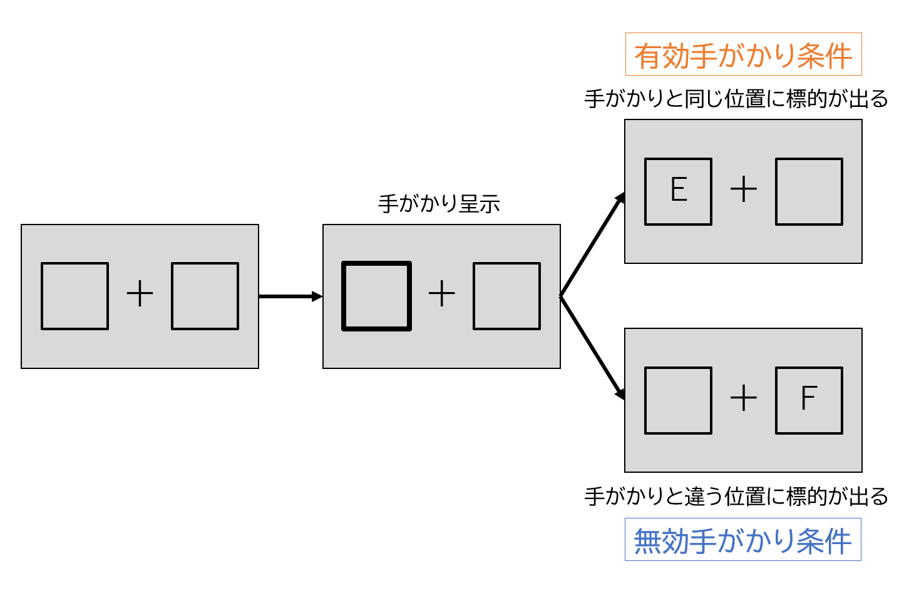

```{r setup, include=FALSE}
knitr::opts_chunk$set(echo = TRUE)
library(tidyverse)
```

## はじめに

[Stan Advent Calender 2019](https://qiita.com/advent-calendar/2019/stan) 16日目の記事です。

近ごろ学会や論文でもdiffusionモデルを扱った研究が増えてきたように思います。自分の[研究](http://ogwlab.org/?p=1425)でもこのモデルをよく使うのですが、知名度の割には参考資料が少ないような気がしています。特に[怖い本](https://bayesmodels.com/)や[実践ベイズモデリング](http://www.asakura.co.jp/G_12.php?isbn=ISBN978-4-254-12220-6)のように、教科書的に使える資料がないなあ、と感じています。そこで今回は自分で作ってみることにしました。うまくできるかはわかりません。お付き合いください。


## Diffusionモデルとは

### 前置き

私は実験屋さん (自称) です。特に視覚的注意に関する実験をしています。注意研究のおもしろいところは、実験課題の種類がとても多いことだと思っています。空間手がかり課題・フランカー課題・視覚探索課題…、など、注意のいろいろな側面を切り出すためのパラダイムがたくさん考案されてきました。一方で、これらの課題を分析する方法はそんなに多くありません。注意メカニズムが働いている状態 (実験群) と働いていない状態 (統制群) の平均反応時間を比較し、その差を"注意"の有無による差であるとすることが多いです。課題によっては正答率を指標とすることもありますが、主流は反応時間でしょう。


### 確率分布としてのdiffusionモデル

慣習的な方法は、平均反応時間をt検定などを使って条件間で比較することです。でも、このやり方では情報量が極端に減ってしまっています。たとえば200試行実施したとして、これを代表値1つに圧縮してしまうのはちょっともったいないですよね。


では反応時間が平均$\mu$・分散$\sigma$の正規分布に従うとしてベイズモデリングをしてみるのはどうでしょう？そうすれば各試行の反応時間をすべて使って分析できます。でも、これだとまだ使っていない情報がありますよね？こういう場合、たいてい正答試行の反応時間のみを取り出して分析することが多いと思います。誤答試行の情報を全部まるごと捨ててしまうのも、なんだかもったいないと思いませんか？


この記事で紹介するdiffusionモデルは、**反応時間と正答率の同時確率分布**です。このモデルでは、2択課題における情報の蓄積→選択までの過程を主に4つのパラメータで表現します。


パラメータ  |  : 解釈
------------- | -------------
$\alpha$ (閾値)  |  : 反応が起こるまでに蓄積する必要のある情報の量
$\beta$  (開始点)  |  : どちらかの反応に対するバイアス
$\delta$ (ドリフト率)  | : 情報の取り込みの平均速度
$\tau$   (非決定時間)  | : 情報集積には関与しない過程 (知覚による符号化など) にかかる時間


確率密度関数は[このような](https://mc-stan.org/docs/2_21/functions-reference/wiener-first-passage-time-distribution.html)数式です。なんだか楽しそうですね。


diffusionモデルの説明をするときに、よく[このような図](https://images.app.goo.gl/XENFKPUcwwpUGGJd6)が使われます。各パラメータがどういう過程に対応しているのかわかりやすくてよいのですが、個人的には直観的すぎてあまり好きではありません。この図を使った説明はごろごろ転がっているので、あえてほとんど触れずに進みます。この図から直観的に理解すると、同時分布感が感じられなくて苦手なのですが、おそらくこちらの方が理解しやすい方もいらっしゃるでしょう。


重要なのはこの2点です。

1. diffusionモデルは**反応時間と正答率の同時確率分布**です。
2. 4つのパラメータで表現されます。


## データを読み込む

ここで実際のデータを使って分析をしてみましょう。今回は空間手がかり課題 (ポズナー課題) のデータを使ってみます。空間手がかり課題をPsychoPyのbuilderで作るチュートリアルを私のボスが書いているので、[こちら](http://ogwlab.org/?page_id=815)もご参照ください。わかりやすくておすすめです。


今回使った課題はこんな流れです。




参加者の課題は、左右の箱のどちらかに呈示される文字 (標的) がEかFかを、キー押しで判断することです。標的呈示前に、「手がかり」として左右どちらかの箱の枠が短い時間だけ太く表示されます。手がかり位置と標的位置が同じ試行を「有効手がかり条件」、異なる試行を「無効手がかり条件」と呼びます。

手がかりと同じ場所に標的が出てくると、手がかりによって注意がその場所に向いている状態なので、すばやく反応できます。一方で手がかりと反対側に標的が出てきたときには、手がかり位置にいったん注意が向いたあとで標的位置まで移動しなければいけないので、少し時間がかかります。この「注意が向いている状態」と「向いていない状態」との差を比較することで、目に見えない"注意"の働きを取り出しています (少なくとも、そのように考えて実験をします)。


```{r message=FALSE, warning=FALSE}
some_data <- read.table(file = "exp.txt", header = T)
head(some_data)
```

誤答試行 (左) ・正答試行 (右) の反応時間はそれぞれこんな感じです。

```{r echo=FALSE, warning=FALSE}
some_data %>%
  dplyr::mutate(correct = if_else(correct == 1, "正答", "誤答"),
                valid = if_else(valid == 1, "有効手がかり", "無効手がかり")) %>%
  ggplot2::ggplot() +
  ggplot2::geom_boxplot(aes(y = rt, x = as.factor(valid), fill = as.factor(valid)), alpha = .2) +
  theme(panel.grid = element_blank(),
        axis.title = element_blank(),
        legend.position = "None",
        axis.text = element_text(size = 12)) +
  facet_wrap(~ correct)
```


## Stanコードを書く

```{stan output.var = "mod"}
data {
  int<lower=1> N;      // 参加者数
  int C;               // 条件数
  
  int<lower=0> N_Re_Te_max; // "E"反応数の最大値, 標的=E
  int<lower=0> N_Rf_Te_max; // "F"反応数の最大値, 標的=E
  int<lower=0> N_Re_Tf_max; // "E"反応数の最大値, 標的=F
  int<lower=0> N_Rf_Tf_max; // "F"反応数の最大値, 標的=F
  
  int<lower=0> N_Re_Te[N, C];  // "E"反応数, 標的=E
  int<lower=0> N_Rf_Te[N, C];  // "F"反応数, 標的=E
  int<lower=0> N_Re_Tf[N, C];  // "E"反応数, 標的=F
  int<lower=0> N_Rf_Tf[N, C];  // "F"反応数, 標的=F

  real RT_Re_Te[N, C, N_Re_Te_max];  // "E"反応をした試行の反応時間, 標的=E
  real RT_Rf_Te[N, C, N_Rf_Te_max];  // "F"反応をした試行の反応時間, 標的=E
  real RT_Re_Tf[N, C, N_Re_Tf_max];  // "E"反応をした試行の反応時間, 標的=F
  real RT_Rf_Tf[N, C, N_Rf_Tf_max];  // "F"反応をした試行の反応時間, 標的=F
  
  real minRT[N];       // 各参加者の反応時間の最小値
  real RTbound;        // 反応時間の打ち切り値
}

parameters {
  vector[3] mu_p;
  vector<lower=0>[3] sigma;
  
  vector<lower=0>[N] alpha_pr[2];
  vector<lower=0>[N] delta_pr[2];
  vector<lower=RTbound,upper=max(minRT)>[N] tau_pr[2];
}

transformed parameters {
  vector<lower=0>[N] alpha[2]; // 閾値
  vector<lower=0>[N] delta[2]; // ドリフト率
  vector<lower=RTbound, upper=max(minRT)>[N] tau[2]; // 非決定時間
  
  for (c in 1:C){
    alpha[c] = exp(mu_p[1] + sigma[1] * alpha_pr[c]);
    delta[c] = exp(mu_p[2] + sigma[2] * delta_pr[c]);
    for (n in 1:N) {
      tau[c][n]  = Phi_approx(mu_p[3] + sigma[3] * tau_pr[c][n]) * (minRT[n]-RTbound) + RTbound;
    }
  }
}

model {
  mu_p  ~ normal(0, 1);
  sigma ~ cauchy(0, 5);

  for(c in 1:C){
   alpha_pr[c] ~ normal(0, 1);
   delta_pr[c] ~ normal(0, 1);
   tau_pr[c]   ~ normal(0, 1);
  }

  for (n in 1:N) {
    for (c in 1:C) {
      // "E"反応, 標的=E
      target += wiener_lpdf(RT_Re_Te[n,c, :N_Re_Te[n,c]] | alpha[c][n], tau[c][n], 0.5, delta[c][n]);
      if(N_Rf_Te[n, c]!=0){
      // "F"反応, 標的=E
        target += wiener_lpdf(RT_Rf_Te[n,c, :N_Rf_Te[n,c]] | alpha[c][n], tau[c][n], 0.5, -delta[c][n]);
        }
      // "F"反応, 標的=F
      target += wiener_lpdf(RT_Rf_Tf[n,c, :N_Rf_Tf[n,c]] | alpha[c][n], tau[c][n], 0.5, delta[c][n]);
      if(N_Re_Tf[n,c]!=0){
      // "E"反応, 標的=F
        target += wiener_lpdf(RT_Re_Tf[n,c, :N_Re_Tf[n,c]] | alpha[c][n], tau[c][n], 0.5, -delta[c][n]);
      }
    }
  }
}

```


## Stanコードのポイント

`transformed parameters`ブロックでややこしいことをしていますが、ここでは`_pr`を標準正規分布から推定して、`exp`で対数のスケールに変換しています。こちらのほうが計算が速いと某先生に教えていただいた書き方です。なので`alpha_pr`の事前分布は`normal`になっていますが、実際の事前分布には対数正規分布を置いていることになります。


`model`ブロックの4つの`wiener_lpdf`については、正直なところあまり自信がありません…。ここでは"E"反応を上側の閾値 ($\alpha$) と置いているので、標的はEのときに正しく"E"方向へ情報集積をした試行と、誤って"F"方向に情報集積をした試行ではドリフト率の正負が異なります。が、stanの`wiener`関数は上方向へのドリフト率しか推定しないので、"F"方向へ行ってしまった試行分については`delta`の正負をひっくり返すことになります。


## データを整える

Stanコードを見たらなんとなくわかると思いますが、階層diffusionをStanでやる場合、少し独特の形にデータを整形する必要があります。書くと本題から外れそうなので、このやり方についてはべつの記事を書きます。そちらを参照してください。

```{r echo=FALSE}
ddhmdataset <- function(rawdata,scale = TRUE){
  if(scale == TRUE){
    RTbound = 50
    RTscale = 1000
  }else{
    RTbound = 0.05
    RTscale = 1
  }
  rawdata <- as.data.frame(rawdata)
  # Individual Subjects
  subjList <- unique(rawdata[,"participant"])
  numSubjs <- length(subjList)
  numC <- 2
  
  # Number of E and F responses for each subject
  # target = E
  rawdata_e <- rawdata[rawdata$target == "E",]
  
  N_Re_Te <- with(rawdata_e, aggregate(correct == 1, by = list(participant, valid), FUN = sum)[["x"]])
  N_Rf_Te <- with(rawdata_e, aggregate(correct == 0, by = list(participant, valid), FUN = sum)[["x"]])
  
  N_Re_Te <- array(N_Re_Te, dim = c(numSubjs, numC))
  N_Rf_Te <- array(N_Rf_Te, dim = c(numSubjs, numC))
  
  
  #target = F
  rawdata_f <- rawdata[rawdata$target == "F",]
  
  N_Rf_Tf <- with(rawdata_f, aggregate(correct == 1, by = list(participant, valid), FUN = sum)[["x"]])
  N_Re_Tf <- with(rawdata_f, aggregate(correct == 0, by = list(participant, valid), FUN = sum)[["x"]])
  
  N_Rf_Tf <- array(N_Rf_Tf, dim = c(numSubjs, numC))
  N_Re_Tf <- array(N_Re_Tf, dim = c(numSubjs, numC))
  
  
  # Minimum reaction time per subject
  minRT <- with(rawdata, aggregate(rt.s, by = list(y = participant), FUN = min)[["x"]])
  
  # Reaction times for left and right responses
  # target = E
  RT_Re_Te <- array(-1, c(numSubjs, numC, max(N_Re_Te)))
  RT_Rf_Te <- array(-1, c(numSubjs, numC, max(N_Rf_Te)))
  
  # target = F
  RT_Re_Tf <- array(-1, c(numSubjs, numC, max(N_Re_Tf)))
  RT_Rf_Tf <- array(-1, c(numSubjs, numC, max(N_Rf_Tf)))
  
  # Reaction time data
  # target = E (upper = E)
  for (i in 1:numSubjs) {
    for (c in 1:2) {
      tmp <- subset(rawdata_e, (rawdata_e$valid == c-1 & rawdata_e$participant == subjList[i]))
      if(N_Rf_Te[i,c]!=0){
        RT_Rf_Te[i, c, 1:N_Rf_Te[i,c]] <- tmp$rt.s[tmp$correct == 0] / RTscale
      }else{
        RT_Rf_Te[i, c, 1] <- -1.0
      }
      RT_Re_Te[i, c, 1:N_Re_Te[i,c]] <- tmp$rt.s[tmp$correct == 1] / RTscale 
    }
  }

  
  # target = F
  for (i in 1:numSubjs) {
    for (c in 1:2) {
      tmp <- subset(rawdata_f, (rawdata_f$valid == c-1 & rawdata_f$participant == subjList[i]))
        if(N_Re_Tf[i,c]!=0){
          RT_Re_Tf[i, c, 1:N_Re_Tf[i,c]] <- tmp$rt.s[tmp$correct == 0] / RTscale
        }else{
          RT_Re_Tf[i, c, 1] <- -1.0
        }
        RT_Rf_Tf[i, c, 1:N_Rf_Tf[i,c]] <- tmp$rt.s[tmp$correct == 1] / RTscale 
      }
    }
  
  # stan data
  dataList <- list(
    N       = numSubjs,# Number of subject
    N_Re_Te_max = max(N_Re_Te),  # Max (across subjects) number of left responses, target=left
    N_Rf_Te_max = max(N_Rf_Te),  # Max (across subjects) number of left responses, target=left
    N_Re_Tf_max = max(N_Re_Tf),  # Max (across subjects) number of left responses, target=left
    N_Rf_Tf_max = max(N_Rf_Tf),  # Max (across subjects) number of left responses, target=left
    
    N_Re_Te = N_Re_Te,    # Number of left responses for each subj, target=left
    N_Rf_Te = N_Rf_Te,     # Number of right responses for each subj, target=left
    N_Re_Tf = N_Re_Tf,    # Number of left responses for each subj, target=right
    N_Rf_Tf = N_Rf_Tf,     # Number of right responses for each subj, target=right
    
    RT_Re_Te = RT_Re_Te,    # left response times, target=left
    RT_Rf_Te = RT_Rf_Te,    # right response times, target=left
    RT_Re_Tf = RT_Re_Tf,    # left response times, target=right
    RT_Rf_Tf = RT_Rf_Tf,    # right response times, target=right
    
    minRT = array(minRT),
    RTbound = RTbound,     # lower bound or RT across all subjects
    C = 2)
  
  # stan inits
  if(scale == TRUE){
    inits_fixed <- c(0.5, 0.5, 0.1)
  }else{
    inits_fixed <- c(3, 2, 0.52)
    inits_delta <- rep(1.2)
  }
  genInitList <- function() {
    list(
      alpha = rep(log(inits_fixed[1])),
      beta = rep(log(inits_fixed[2])),
      delta = rep(log(inits_delta[1])),
      tau   = rep(qnorm(inits_fixed[3]))
      #array(Nu, dim = c(numSubjs, numG))
    )
  }
  return(list(dataList=dataList, genInitList=genInitList))
}


dat.ddm <- some_data %>%
  dplyr::mutate(rt.s = rt / 1000) %>%
  dplyr::filter(rt.s > 0.1) %>%
  dplyr::select(rt.s, correct, target, valid, participant)
dat <- ddhmdataset(dat.ddm, scale = FALSE)
```


```{r}
str(dat)
```


こういう形に整形できたら、データの準備は完了です。


## MCMC!

(*´Д`)ﾊｧﾊｧしてみましょう。

```{r eval=FALSE}
library(rstan)
mod <- rstan::stan_model("stanmodel.stan")
fit <- rstan::sampling(mod,
                       data = dat$dataList,
                       iter = 4000,
                       warmup = 1000,
                       chains = 4,
                       cores = 4,
                       init = dat$genInitList)
```


```{r echo=FALSE}
fit <- readRDS("exp.RDS")
```

20秒ぐらいで収束しました。中身を見てみます。

```{r}
print(fit)
```


トレースプロットもいい感じです。収束感が感じられるので`inc_warmup = T`派です (そんな派閥はない)。

```{r}
rstan::traceplot(fit, pars = c("alpha", "delta", "tau"), inc_warmup = T)
```


$\delta$の事後分布をプロットしてみます。最近`tidybayes`にはまっています。手がかり条件は1: 無効、2: 有効、となっています。

```{r warning=FALSE}
library(tidybayes)
fit %>% 
  tidybayes::spread_draws(delta[valid, subj]) %>%
  ggplot2::ggplot(aes(x = delta, y = as.factor(valid))) +
  tidybayes::stat_pointintervalh() +
  theme(panel.grid.major.y = element_blank(),
        axis.title = element_text(size = 15)) +
  ylab("手がかり条件") +
  xlab(expression(delta))
```


このように、反応時間と正答率の同時確率分布を用いて、パラメータを推定することができました。空間手がかり課題で注意が向いている・いない条件の違いがドリフト率に反映されていそうなことがわかります。今回は正答率が極端に高い課題を使ったのであんまり推定結果がおもしろくないのですが、反応時間と正答率のトレードオフが起こるような課題を使うともっと楽しいと思います。


## まとめ


ベイズモデリングをする動機づけはいろいろあると思いますが、私にとっては実験で得られたデータからありったけの情報を搾り取ることができる (場合がある) というのが一番の動機です。diffusionモデルでは各試行の正答率と反応時間を同時に考慮することができて、そういう点では自分がやりたいことに近いと感じます。奥深いモデルですが、比較的容易に実装できるところも魅力です。皆さんもぜひdiffusionで(*´Д`)ﾊｧﾊｧしましょう。