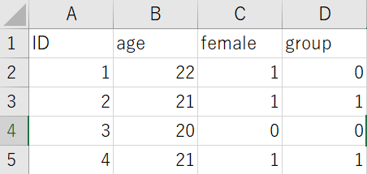

```{r setup, include=FALSE}
knitr::opts_chunk$set(echo = TRUE)
library(tidyverse)
```

## 参加者情報の整理は面倒

ふだん実験を作るときには[PsychoPy](https://www.psychopy.org/)のCoderを使っています。余談ですが、これまでPsychoPyのエディタ上でずっとコードを書いていて特に不便もなかったのですが、最近VS Codeに乗り換えました。超書きやすいです。

さて、今回の本題は「ダイアログボックスに入力した参加者情報を一つのファイルに保存する」ことです。イメージとしてはこんな感じです。



まず実験開始前にダイアログボックスを出します。

```{python}
from psychopy.tools.filetools import fromFile, toFile
from psychopy import data

try:
    expInfo = fromFile("lastParams.pickle")
except:
    expInfo = {"participant":"", "female": [0,1], "age":"", "group": [0,1]}
expInfo["dataStr"] = data.getDateStr()
```


