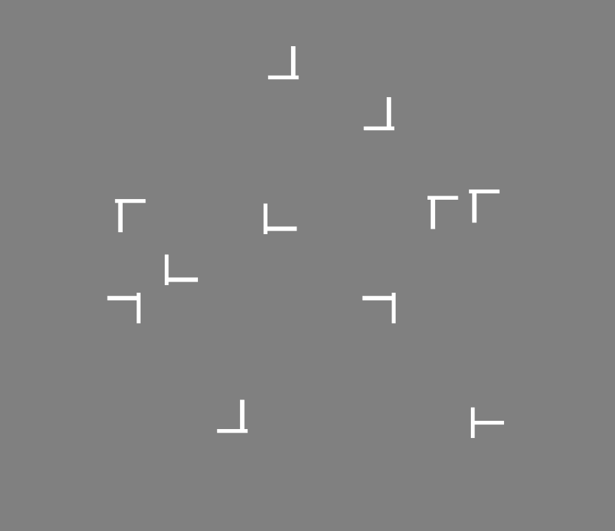

```{r setup, include=FALSE, warning=FALSE}
library(tidyverse)
#library(rethinking)
library(rstan)
library(rmdformats)
library(knitr)
library(kableExtra)
library(brms)

## Global options
options(max.print="75")
knitr::opts_chunk$set(echo=FALSE,
                 cache=TRUE,
               prompt=FALSE,
               tidy=TRUE,
               comment=NA,
               message=FALSE,
               warning=FALSE)
opts_knit$set(width=75)
```

# ~~私~~  実験心理学者のための統計モデリング


私がベイジアンになってから1年近く経過し、その間にそれなりのモデリング経験を積んできました。ただ、「ベイズモデリングについて勉強する」ことと「実際にモデリングを研究で使う」こととの間に、そこそこ大きなギャップがあったように感じています。実際に学会等で皆さんのご意見を聞いていると、こういったギャップが実験心理学者をモデリングから遠ざける要因になっていると思います。そこで本セッションでは、なるべく実験心理学者の視点に立って、実験心理学の分野でベイズモデリングをどのように使っていくことができるのか一例を示します。実験心理学においてベイズモデリングの導入や利用法に関する議論の材料となれば幸いです。

本セッションの内容のうち、「統計モデリング入門」は[Statistical Rethinking第2版](https://xcelab.net/rm/statistical-rethinking/) および、その内容を`tidyverse`と`brms`で再現した[Statistical Rethinking with brms, ggplot2, and the tidyverse](https://bookdown.org/connect/#/apps/1850/access)にかなり依拠していますが、内容に誤りがあった場合は私の勘違いや誤りである可能性が高いです。ご指摘ください。


研究に対する姿勢について考え直すきっかけをくれた先輩に「なんでモデリング？」と聞かれたときに、ろくな返事ができなかったことをずっと後悔していました。これはそのときの返事の代わりです。統計モデリングってのもちょっとおもしろそう、とその人に思ってもらえたら幸せだな、と妄想しながら書きました。


## 本セッションの目的

1. 実験心理学で統計モデリングをいかに活用していくか（あるいは利用しないのか）を議論する
2. `brms` (ときどきStan) を使って、実験心理学で使えそうな基本的なモデルを実装できるようになる

# 導入

「ベイズについて勉強はしてみたが、どう使うものかがよくわからない」という声をときどき耳にします（実際に、私が先輩方からこの質問をされたこと、それに対して満足のいく返答ができなかったことが本セッションの動機になっています）。そこで、本セッションでは実験心理学者には馴染み深い課題である視覚探索課題 (visual search) を例に、ベイズモデリングをどう使うことができるのか（あるいは使わないでおくのがよいのか）を考えたいと思います。

## 実験心理学者**でない**人のための視覚探索課題入門

私たちの周囲には多くの情報があり、それらすべてを一度に処理することはできません（今、皆さんはこの文章を読んでいると思いますが、その間にも触覚や聴覚からさまざまな情報が入ってきているはずです。たとえば椅子の感触はどうでしょう？今この瞬間まで椅子の感触には"注意"していなかったと思いますが、その間もずっと椅子の座面の感覚は入力されてきているはずです。なぜ常に椅子の感触を感じないでいられるのでしょう？）。注意研究の特徴は、豊富かつ独創的な実験パラダイムです（私個人の意見です）。

なかでも視覚探索課題は、視覚情報の選択システムである視覚的注意 (visual attention) の働きを調べるために広く用いられる課題です。

{width=250px}

上に、典型的な視覚探索課題の試行画面を示しました。参加者の課題は標的刺激 (ここではT) を妨害刺激 (ここではL) の中から探すことです。

標的刺激に対して効率的に注意を誘導できるなら、Tをすぐに見つけることができます。たとえばこの画面でTのみが赤色で描かれていたとしたら、わざわざ探そうとしなくてもひとりでにTが目に飛び込んでくるような感じを覚えるでしょう。注意の誘導が非効率的なときには、各刺激に対して順番に注意を向けていく必要があり、そのために標的が見つかるまでの時間は長くなります。このような状況を非効率探索と呼ぶことにします。非効率探索の状況下では、画面上の刺激の数 (セットサイズ) が増えるほど反応時間は長くなります。反応時間は線形に増えていくことがわかっていて、この増加の様子を$$y=ax+b$$という一次関数 (探索関数) であらわし、傾き$a$を探索勾配と呼んで探索の効率性の指標として使うこともあります。

```{r echo=FALSE}
# sample data ------------------------------
N_trial = 1000 # 一つの条件における試行数
N_subject = 5 # 実験参加者数

set.seed(123)

mean1 <- rnorm(N_subject, mean = 500, sd = 50)
mean2 <- rnorm(N_subject, mean = 650, sd = 50)


# 以下は順に、実験参加者1の条件1、条件2、実験参加者2の条件1、...、実験参加者5の条件2
dat_all <-  
      c(rnorm(N_trial, mean = mean1[1], sd = 100),
        rnorm(N_trial, mean = mean2[1], sd = 100),
        rnorm(N_trial, mean = mean1[2], sd = 50),
        rnorm(N_trial, mean = mean2[2], sd = 50),
        rnorm(N_trial, mean = mean1[3], sd = 80),
        rnorm(N_trial, mean = mean2[3], sd = 80),
        rnorm(N_trial, mean = mean1[4], sd = 70),
        rnorm(N_trial, mean = mean2[4], sd = 70),
        rnorm(N_trial, mean = mean1[5], sd = 110),
        rnorm(N_trial, mean = mean2[5], sd = 110))
```


```{r echo=FALSE}
dat_all %>%  
  as.data.frame() %>%
  dplyr::mutate(ID = rep(1:N_subject, each = 2 * N_trial),
                condition = as.factor(rep(c(5, 10), each = N_trial, time = N_subject))) %>%
  dplyr::rename(RT = '.') %>%
  dplyr::group_by(ID, condition) %>%
  dplyr::summarise(mean_rt = mean(RT)) %>%
  ggplot(aes(y = mean_rt, x = condition)) +
  geom_point() +
  stat_summary(fun.y = "mean", geom = "line", group = 1) +
  stat_summary(fun.y = "mean", geom = "point", group = 1, size = 3, color = "deeppink4") +
  theme(panel.grid = element_blank()) +
  labs(title = "図2: 視覚探索課題の反応時間サンプル",
       x = "セットサイズ",
       y = "反応時間 (ms)")
```


# 統計モデリング入門

上に示したような視覚探索課題のサンプルデータを使って、実際に統計モデリングをやってみます。その前に、ベイズ統計モデリングとはいったい何をやっているのか、簡単に紹介します。

## 数えて・比べる

McElreath (2016) によると、ベイズ統計モデリングの根っこにあるのは「数える」・「比べる」という2つの要素です。彼の「The garden of forking data」という喩えがとてもわかりやすかったので、その例に沿って説明していきます。なお、このページで使っている図は[こちら](https://bookdown.org/ajkurz/Statistical_Rethinking_recoded/small-worlds-and-large-worlds.html#the-garden-of-forking-data)を参考にしました。`tidyverse`と`ggplot2`でこんな図が描けるんだ！と感動した方は、ぜひ読んでみてください。

まず、目の前に碁石が4つ入った袋があると想像してください。中身は見えませんが、黒と白の碁石が合計4つ入っていることはわかっています。つまり、この袋に入っている可能性のある碁石の組み合わせは以下の5種類となります。この5種類のことを、ここでは「可能性」と呼びたいと思います。便宜上の呼び名なので、深い意味はありません。

```{r fig.width=3, fig.height=1.5, echo=FALSE}
d <-
  tibble(p_1 = 0,
         p_2 = rep(1:0, times = c(1, 3)),
         p_3 = rep(1:0, times = c(2, 2)),
         p_4 = rep(1:0, times = c(3, 1)),
         p_5 = 1)

d %>% 
  gather() %>% 
  mutate(x = rep(1:4, times = 5),
         possibility = rep(1:5, each = 4)) %>% 
  
  ggplot(aes(x = x, y = possibility, 
             fill = value %>% as.character())) +
  geom_point(shape = 21, size = 5) +
  scale_fill_manual(values = c("white", "navy")) +
  scale_x_continuous(NULL, breaks = NULL) +
  coord_cartesian(xlim = c(.75, 4.25),
                  ylim = c(.75, 5.25)) +
  theme(legend.position = "none",
        axis.title = element_blank(),
        panel.grid.minor.y = element_blank()) +
  labs(title = "図3: 碁石の組み合わせ (可能性)")
```

今、その袋の中に手を入れて碁石を一つ取り出して色を確認し、その後袋に戻します。これを3回繰り返します。各碁石が取り出される確率は等しいと考えると、碁石を出しては戻す作業を3回繰り返したときに出てくる可能性のある碁石3つの組み合わせは各可能性ごとに$4^3 = 64$通りです。たとえば碁石の組み合わせが2番のように*黒-白-白-白*のとき、あり得る碁石の組み合わせを樹形図で表すとこんな感じに描けます。

```{r include=FALSE}
d <-
  tibble(position = c((1:4^1) / 4^0, 
                      (1:4^2) / 4^1, 
                      (1:4^3) / 4^2),
         draw     = rep(1:3, times = c(4^1, 4^2, 4^3)),
         fill     = rep(c("b", "w"), times = c(1, 3)) %>% 
           rep(., times = c(4^0 + 4^1 + 4^2)))
lines_1 <-
  tibble(x    = rep((1:4), each = 4),
         xend = ((1:4^2) / 4),
         y    = 1,
         yend = 2)
lines_2 <-
  tibble(x    = rep(((1:4^2) / 4), each = 4),
         xend = (1:4^3) / (4^2),
         y    = 2,
         yend = 3)


lines_1 <-
  lines_1 %>% 
  mutate(remain = c(rep(0:1, times = c(1, 3)),
                    rep(0,   times = 4 * 3)))  
lines_1 <-
  tibble(x    = rep((1:4), each = 4),
         xend = ((1:4^2) / 4),
         y    = 1,
       yend = 2)
lines_1 <-
  lines_1 %>% 
  mutate(x    = x - .5,
         xend = xend - .5 / 4^1)
lines_2 <-
  lines_2 %>% 
  mutate(remain = c(rep(0,   times = 4),
                    rep(1:0, times = c(1, 3)) %>% 
                      rep(., times = 3),
                    rep(0,   times = 12 * 4)))
lines_2 <-
  tibble(x    = rep(((1:4^2) / 4), each = 4),
         xend = (1:4^3) / (4^2),
         y    = 2,
         yend = 3)
lines_2 <-
  lines_2 %>% 
  mutate(x    = x - .5 / 4^1,
         xend = xend - .5 / 4^2)

d <-
  d %>% 
  mutate(denominator = ifelse(draw == 1, .5,
                              ifelse(draw == 2, .5 / 4,
                                     .5 / 4^2))) %>% 
  mutate(position    = position - denominator)

lines_1 <-
  lines_1 %>% 
  mutate(remain = c(rep(0:1, times = c(1, 3)),
                    rep(0,   times = 4 * 3)))

lines_2 <-
  lines_2 %>% 
  mutate(remain = c(rep(0,   times = 4),
                    rep(1:0, times = c(1, 3)) %>% 
                      rep(., times = 3),
                    rep(0,   times = 12 * 4)))

d <-
  d %>% 
  mutate(remain = c(rep(1:0, times = c(1, 3)),
                    rep(0:1, times = c(1, 3)),
                    rep(0,   times = 4 * 4),
                    rep(1:0, times = c(1, 3)) %>% 
                      rep(., times = 3),
                    rep(0,   times = 12 * 4))) 
```

```{r fig.width=10, fig.height=3, echo=FALSE}
d %>% 
  ggplot(aes(x = position, y = draw)) +
  geom_segment(data  = lines_1,
               aes(x = x, xend = xend,
                   y = y, yend = yend),
               size  = 1/3) +
  geom_segment(data  = lines_2,
               aes(x = x, xend = xend,
                   y = y, yend = yend),
               size  = 1/3) +
  geom_point(aes(fill = fill), 
             shape = 21, size = 4) +
  scale_fill_manual(values  = c("navy", "white")) +
  scale_x_continuous(NULL, limits = c(0, 4), breaks = NULL) +
  scale_y_continuous(breaks = c(1,2,3), limits = c(0.75, 3)) +
  theme(panel.grid      = element_blank(),
        legend.position = "none",
        axis.title = element_blank()) +
  labs(title = "図4: 引いた結果の組み合わせ")
```

3回引いた結果を見てみると、**黒-白-黒**という組み合わせになりました。これを**データ**と呼びましょう。このとき袋の中に入っている碁石の組み合わせとして、どれが一番ありえるでしょうか？これを確かめる方法が「数えて」・「比べる」です。やってみます。

といってもやり方は簡単です。上の樹形図をすべての可能性について描き、その中から**黒-白-黒**という組み合わせになっている経路を探して、その数を数えればいいのです。引いた結果、黒と白が少なくとも1つずつ含まれていることはわかるので、1番と5番の可能性は排除されます。残りの3つについての樹形図を描きました。

```{r fig.width=10, fig.height=3}
n_blue <- function(x){
  rowSums(x == "黒")
}

n_white <- function(x){
  rowSums(x == "白")
}

t <-
  # for the first four columns, `p_` indexes position
  tibble(p_1 = rep(c("白", "黒"), times = c(1, 4)),
         p_2 = rep(c("白", "黒"), times = c(2, 3)),
         p_3 = rep(c("白", "黒"), times = c(3, 2)),
         p_4 = rep(c("白", "黒"), times = c(4, 1))) %>% 
  mutate(`draw 1: blue`  = n_blue(.),
         `draw 2: white` = n_white(.),
         `draw 3: blue`  = n_blue(.)) %>% 
  mutate(`ways to produce` = `draw 1: blue` * `draw 2: white` * `draw 3: blue`)


d <-
  tibble(position = c((1:4^1) / 4^0, 
                      (1:4^2) / 4^1, 
                      (1:4^3) / 4^2),
         draw     = rep(1:3, times = c(4^1, 4^2, 4^3)))
d <-
  d %>% 
  bind_rows(
    d, d
  ) %>% 
  # here are the fill colors
  mutate(fill = c(rep(c("白", "黒"), times = c(1, 3)) %>% rep(., times = c(4^0 + 4^1 + 4^2)),
                  rep(c("白", "黒"), each  = 2)       %>% rep(., times = c(4^0 + 4^1 + 4^2)),
                  rep(c("白", "黒"), times = c(3, 1)) %>% rep(., times = c(4^0 + 4^1 + 4^2)))) %>% 
  # now we need to shift the positions over in accordance with draw, like before
  mutate(denominator = ifelse(draw == 1, .5,
                              ifelse(draw == 2, .5 / 4,
                                     .5 / 4^2))) %>% 
  mutate(position = position - denominator) %>% 
  # here we'll add an index for which pie wedge we're working with
  mutate(pie_index = rep(letters[1:3], each = n()/3)) %>% 
  # to get the position axis correct for pie_index == "b" or "c", we'll need to offset
  mutate(position = ifelse(pie_index == "a", position,
                           ifelse(pie_index == "b", position + 4,
                                  position + 4 * 2)))

move_over <- function(position, index){
  ifelse(index == "a", position,
         ifelse(index == "b", position + 4,
                position + 4 * 2)
         )
}

lines_1 <-
  tibble(x    = rep((1:4), each = 4) %>% rep(., times = 3),
         xend = ((1:4^2) / 4)        %>% rep(., times = 3),
         y    = 1,
         yend = 2) %>% 
  mutate(x    = x - .5,
         xend = xend - .5 / 4^1) %>% 
  # here we'll add an index for which pie wedge we're working with
  mutate(pie_index = rep(letters[1:3], each = n()/3)) %>% 
  # to get the position axis correct for `pie_index == "b"` or `"c"`, we'll need to offset
  mutate(x    = move_over(position = x,    index = pie_index),
         xend = move_over(position = xend, index = pie_index))

lines_2 <-
  tibble(x    = rep(((1:4^2) / 4), each = 4)  %>% rep(., times = 3),
         xend = (1:4^3 / 4^2)                 %>% rep(., times = 3),
         y    = 2,
         yend = 3) %>% 
  mutate(x    = x - .5 / 4^1,
         xend = xend - .5 / 4^2) %>% 
  # here we'll add an index for which pie wedge we're working with
  mutate(pie_index = rep(letters[1:3], each = n()/3)) %>% 
  # to get the position axis correct for `pie_index == "b"` or `"c"`, we'll need to offset
  mutate(x    = move_over(position = x,    index = pie_index),
         xend = move_over(position = xend, index = pie_index))

d <- 
  d %>% 
  mutate(remain = c(# `pie_index == "a"`
                    rep(0:1, times = c(1, 3)),
                    rep(0,   times = 4),
                    rep(1:0, times = c(1, 3)) %>% 
                      rep(., times = 3),
                    rep(0,   times = 4 * 4),
                    rep(c(0, 1, 0), times = c(1, 3, 4 * 3)) %>% 
                      rep(., times = 3),
                    # `pie_index == "b"`
                    rep(0:1, each = 2),
                    rep(0,   times = 4 * 2),
                    rep(1:0, each = 2) %>% 
                      rep(., times = 2),
                    rep(0,   times = 4 * 4 * 2),
                    rep(c(0, 1, 0, 1, 0), times = c(2, 2, 2, 2, 8)) %>% 
                      rep(., times = 2),
                    # `pie_index == "c"`
                    rep(0:1, times = c(3, 1)),
                    rep(0,   times = 4 * 3),
                    rep(1:0, times = c(3, 1)), 
                    rep(0,   times = 4 * 4 * 3),
                    rep(0:1, times = c(3, 1)) %>% 
                      rep(., times = 3),
                    rep(0,   times = 4)
                    )
         )

lines_1 <-
  lines_1 %>% 
  mutate(remain = c(rep(0,   times = 4),
                    rep(1:0, times = c(1, 3)) %>% 
                      rep(., times = 3),
                    rep(0,   times = 4 * 2),
                    rep(1:0, each  = 2) %>% 
                      rep(., times = 2),
                    rep(0,   times = 4 * 3),
                    rep(1:0, times = c(3, 1))
                    )
         )

lines_2 <-
  lines_2 %>% 
  mutate(remain = c(rep(0,   times = 4 * 4),
                    rep(c(0, 1, 0), times = c(1, 3, 4 * 3)) %>% 
                      rep(., times = 3),
                    rep(0,   times = 4 * 8),
                    rep(c(0, 1, 0, 1, 0), times = c(2, 2, 2, 2, 8)) %>% 
                      rep(., times = 2),
                    rep(0,   times = 4 * 4 * 3),
                    rep(0:1, times = c(3, 1)) %>% 
                      rep(., times = 3),
                    rep(0,   times = 4)
                    )
         )

d %>% 
  ggplot(aes(x = position, y = draw)) +
  geom_vline(xintercept = c(0, 4, 8), color = "white", size = 2/3) +
  geom_segment(data  = lines_1,
               aes(x = x, xend = xend,
                   y = y, yend = yend,
                   alpha = remain %>% as.character()),
               size  = 1/3) +
  geom_segment(data  = lines_2,
               aes(x = x, xend = xend,
                   y = y, yend = yend,
                   alpha = remain %>% as.character()),
               size  = 1/3) +
  geom_point(aes(fill = fill, size = draw, alpha = remain %>% as.character()),
             shape = 21) +
  scale_size_continuous(range = c(3, 1.5)) +
  scale_alpha_manual(values = c(1/10, 1)) +
  scale_fill_manual(values  = c("navy", "white")) +
  scale_x_continuous(NULL, limits = c(0, 12),     breaks = NULL) +
  scale_y_continuous(NULL, limits = c(0.75, 3.5), breaks = NULL) +
  theme(panel.grid      = element_blank(),
        legend.position = "none")+
  labs(title = "図5: 引いた結果の組み合わせ (2)")
```


他の可能性についても数えた結果を下の表に示します。また、データが生じる経路の数を、経路の数の合計で割った値を**もっともらしさ**と呼ぶことにします。

```{r}
tb1 <- t %>% 
  select(p_1:p_4) %>% 
  mutate(p                      = seq(from = 0, to = 1, by = .25),
         `ways to produce data` = c(0, 3, 8, 9, 0)) %>% 
  mutate(plausibility           = `ways to produce data` / sum(`ways to produce data`)) %>%
  dplyr::rename("データが生じる経路の数" = `ways to produce data`,
                "もっともらしさ" = plausibility)

knitr::kable(tb1) %>%
  kableExtra::kable_styling()
```

もっともらしさが一番高いのは、**黒-黒-黒-白**という可能性だということがわかりました。得られたデータから、そのデータが生じる経路の数を「数えて」、他の可能性と「比べる」という手順の結果、どの可能性が一番ありえそうかがわかりました。もちろん正解かどうかはわかりませんので、一つの推測にすぎません。ただ、今後データの数が増えれば情報が更新されて、より実際に近い推測ができるようになります。

用語を整理します。

- まず、推測できる黒い碁石の割合$p$をパラメタと呼びます。データを説明するにあたって、ありうる可能性を示す値です。
- $p$がデータを生じうる経路の相対的な数を尤度 (likelihood) と呼びます。

実は、ベイズ統計モデリングと呼ばれるものは、すべてこのような「数えて」・「比べる」という手順に則っておこなわれています。どういうこと？と思った方もいらっしゃるのではないでしょうか。

ここで少し元の目的に立ち戻って、「統計モデリングとは何か」をもう一度考えてみます。McElreath (2016) は「データがどのようにして生まれてきたのか、ストーリーを作る」ことであると言っています。どういうことでしょうか。

ここでコイントスの例をあげることが多いと思うのですが、このコイントスの例、というのは曲者ですね。ベイズから遠ざかる一因のような気もします。McElreath (2016) にならって、コインではなく「地球儀トス」の例で考えてみます。

地球の表面の7割は海です。ただ、これを実際に測るのは相当大変です。そこで地球儀を投げて、手のひらに海の部分が触れたらW (water)、陸の部分が触れたらL (land) と記録することにします。このトスを10回繰り返し、その結果得られたデータから海が占める真の割合を推測します。

以下のようなモデルになります。

1. 海が地表に占める心の割合はは$p$である
2. 各トスで、手のひらに:
    - 海が触れる確率は$p$
    - 陸が触れる確率は$1-p$
3. 各トスは独立である

このような仮定をふまえて自分で尤度 (likelihood; データのもっともらしさを表す数式) を考えることもできますが、既成の尤度関数を使うことが多いでしょう。この場合は2値データなので、二項分布を利用することになります。

尤度やらパラメタやら、複雑な言葉が多く出てくるのでビビりますが、二項分布のパラメタをベイズ推定する手順においてやっていることは、さっきまでの「数えて」・「比べる」です。想像してください。あらゆるパラメタの組み合わせを持った無限個の二項分布があります。このあらゆる種類の分布を碁石の例と同じように検証して、各分布のもっともらしさを求めてランク付けします。このもっともらしさランキングが、分布がデータとモデルに一致するかどうかを示す指標になります。

簡単なシミュレーションをやってみます。上の地球トス問題で、あらゆるパラメタの値が詰まった袋があると考えます。その中から10000個のサンプルを取り出します。もし袋がうまく混ざっていれば、取り出したサンプルは事後確率分布に近い形になるはずです。

まず、その袋を作ります。


```{r echo=TRUE}
n <- 1001
n_water <- 6
n_trials  <- 9

d <- tibble(p_grid     = seq(from = 0, to = 1, length.out = n),
            prior      = 1) %>% 
  dplyr::mutate(likelihood = dbinom(n_water, size = n_trials, prob = p_grid)) %>% 
  dplyr::mutate(posterior  = (likelihood * prior) / sum(likelihood * prior))

d %>%
  dplyr::rename("パラメタ" = p_grid, "事前確率" = prior,
                "尤度" = likelihood, "事後確率" = posterior) %>%
  knitr::kable() %>%
  kableExtra::kable_styling() %>%
  scroll_box(width = "100%", height = "200px")
  
```


いきなり事前確率という言葉が出てきました。これは「データを得る前の、各可能性のもっともらしさ」です。詳しい説明は省きますが、モデルの行動を容易にするための仮定の一つです。今回は平らな事前確率を使いました。各可能性のもっともらしさがすべて1になっています。

```{r}
d %>%
  ggplot(aes(x = p_grid, y = prior)) +
  geom_density(color = "skyblue3", fill = "skyblue3", size = 1.5) +
  scale_x_continuous(NULL, breaks = c(0, .5, 1)) +
  scale_y_continuous(NULL, breaks = NULL) +
  theme(panel.grid       = element_blank(),
        strip.background = element_blank(),
        strip.text       = element_blank(),
        axis.title = element_blank()) +
  ylim(c(0,2)) +
  labs(title = "図6: 事前確率の例")
```


現象について事前にわかっていることを、この事前確率に反映させることもできます。事前確率と尤度を用いて、事後確率を計算できます。Rコードを見たらわかりますが、事前確率と尤度をかけたものです。上の碁石の例で行くならこういうことになりますね。

```{r}
t %>% 
  rename(`previous counts` = `ways to produce`,
         `ways to produce` = `draw 1: blue`) %>% 
  select(p_1:p_4, `ways to produce`, `previous counts`) %>% 
  mutate(`new count` = `ways to produce` * `previous counts`) %>%
  dplyr::rename(`データが生じる経路の数` = `ways to produce`, 
                `事前に数えたときの情報` = `previous counts`,
                `新しい情報` = `new count`) %>%
  knitr::kable() %>%
  kableExtra::kable_styling()
```


次に、袋からサンプルを10000個取り出します。

```{r echo=TRUE}
# how many samples would you like?
n_samples <- 1e4

# make it reproducible
set.seed(3)

samples <-
  d %>% 
  sample_n(size = n_samples, weight = posterior, replace = T)

samples %>% 
  mutate(sample_number = 1:n()) %>% 
  ggplot(aes(x = sample_number, y = p_grid)) +
  geom_line(size = 1/10, color = "skyblue4") +
  labs(x = "サンプル",
       y = "海が占める割合 (p)",
       title = "図7: サンプリングのイメージ")
```

```{r}
samples %>% 
  ggplot(aes(x = p_grid)) +
  geom_density(fill = "skyblue4") +
  coord_cartesian(xlim = 0:1) +
  theme(panel.grid = element_blank()) +
  labs(title = "図8: サンプリング結果",
       x = "海が占める割合 (p)")
```


二項分布および二項分布を使ったパラメタ推定については、興味のある方は[こちら](https://bookdown.org/ajkurz/Statistical_Rethinking_recoded/small-worlds-and-large-worlds.html#components-of-the-model)が参考になります。


# 簡単な線形モデル


## 視覚探索データを使った線形モデル

視覚探索課題で、セットサイズ (画面上の刺激数) が多くなると反応時間は増加します。いよいよ、この様子をモデリングしてみたいと思います。

### 線形モデルのイメージ

その前に、線形モデルのイメージをつかんでおきたいと思います。私はここで詰まりました。正規分布とか二項分布のパラメタ推定のイメージはつかめても、線形モデルにしたとたん「数えて」・「比べる」イメージがよくわからなくなりませんか？線形モデルについて表すときには、こういう書き方が一般的です。数式が出てきたからと言ってびっくりしないでいただきたいと思います。言っている内容は簡単です。

$$t_i\sim {\sf Normal}(\mu_i, \sigma)$$

$$\mu_i = \alpha + \beta x_i $$

1. 各試行の反応時間$t_i$は平均$\mu$、分散$\sigma$の正規分布にしたがう
2. 正規分布の平均$\mu$は、$\alpha$と$\beta$という他の2つのパラメタから構成される。$x_i$ (ここではその試行でのセットサイズ) が0のとき$\mu=\alpha$になり、$x_i$が1増えるごとに$\mu$は$\beta$ずつ増える

「数えて」・「比べ」てみます。この場合は、$\alpha$と$\beta$も含めたパラメタの、ありうるすべての組み合わせについて、データを生じうる経路の数を数えていきます。そして、碁石の例と同様に各組合せのもっともらしさをランク付けして、モデルとデータが与えられた時の相対的もっともらしさ (≒事後確率) を求めます。線形モデルになっても「数えて」・「比べ」ているのがわかるでしょうか？

### Stanで書いてみよう!

### 視覚探索データ

視覚探索課題のサンプルデータを作ってみました。こういう形をしています。

```{r}
dat <- dat_all %>%  
  as.data.frame() %>%
  dplyr::mutate(ID = rep(1:N_subject, each = 2 * N_trial),
                condition = rep(c(5, 10), each = N_trial, time = N_subject)) %>%
  dplyr::rename(RT = '.')

str(dat)
```

RTは各試行の反応時間 (ms)、IDは各参加者 (全部で5人います)、conditionがセットサイズ (5, 10) を示しています。

まず、反応時間を中心化・標準化しておきたいと思います。このあとは標準化した反応時間 (`rt.s`) を使っていきます。

```{r}
dat <- dat %>%
  dplyr::mutate(rt.c = RT - mean(RT, na.rm = TRUE),
                rt.s = (RT - mean(RT, na.rm = TRUE)) / sd(RT))

kable(head(dat)) %>%
  kableExtra::kable_styling()
```


#### Stanコード

Stanコードはこういう姿をしています。


<details><summary>サンプルコード</summary><div>

```
data {
  int<lower=1> N;
  vector[N] setsize;
  vector[N] RT;
}

parameters {
  real alpha;
  real beta;
  real<lower=0> sigma;
}

model {
  vector[N] mu = alpha + beta * setsize;
  target += normal_lpdf(RT | mu, sigma);
  target += normal_lpdf(alpha | 0, 10);
  target += normal_lpdf(beta | 0, 10);
  target += cauchy_lpdf(sigma | 0, 10) - cauchy_lccdf(0 | 0, 10);
}

```
</div></details>


おもに3つのブロックで構成されていて、それぞれ`data`、`parameters`、`model`ブロックといいます。`data`ブロックにはデータを、`parameters`ブロックにはパラメタを、`model`ブロックにはモデルを書きます。当たり前です。Stanコードの書き方については[こういった](https://www.slideshare.net/simizu706/stan-62042940)素敵な資料がありますので、そちらを参照してください。ここでは詳解はしません。私が当初混乱したからです。

そのかわりに登場するのが`brms`です。`brms`についても[このような](https://das-kino.hatenablog.com/entry/2018/12/15/230938)素敵な資料がありますので、詳しくはそちらを参照してください。こちらの資料から引用させていただくと、`brms`とは、

>Stanのラッパーパッケージですが、ユーザは自身でStanコードを書く必要はなく、モデルを指定すると自動的に内部でStanコードが生成され、サンプリングが実行されます。

個人的にはStanから入ったので`brms`には慣れていないのですが、モデリングのハードルを下げるいいパッケージだと思っています。Stanの書き方を勉強しつつ、最初は`brms`、というのもよいのではないでしょうか。

```{r echo=TRUE, eval=FALSE}
install.packages("brms")
library(brms)
```

`brms`コードに入れるためにデータを整形します。なお、このデータは上記のStanコードでも使えます。

```{r echo=TRUE}
dat1 <- list(N = NROW(dat),
             ID = dat$ID,
            setsize = dat$condition,
            RT = dat$rt.s)
```


`brms`コードの書き方は、`lmerTest`パッケージなどになじんでいる人には簡単です。私はまだ混乱していますが。

- $t_i\sim {\sf Normal}(\mu_i, \sigma)$ ``family = "gaussian"``

- $\mu_i = \alpha + \beta x_i$ ``RT ~ 1 + setsize``

`prior`以下は**事前分布**の指定です。ベイズ推定には必要な要素です。データを得る前の (事前の) もっともらしさ、を示しています。事前分布にどういう分布を置くのかは非常に難しい問題ですが、一般的に広めの分布を置くことが多いです。詳しくは[このマニュアル](https://github.com/stan-dev/stan/wiki/Prior-Choice-Recommendations)を参照してください。ここでは切片 ($\alpha$) と傾き ($\beta$) の事前分布に平均0, 分散10の正規分布を置き、$\sigma$の事前分布には半コーシー分布を使いました。

```{r echo=TRUE, eval=FALSE}
fit1 <- brm(RT ~ 1 + setsize,
            family = "gaussian",
            data = dat1,
            iter = 3000,
            warmup = 1000,
            chain = 2,
            cores = 2,
            prior = c(prior(normal(0, 10), class = Intercept),
                      prior(normal(0, 10), class = b),
                      prior(cauchy(0, 10), class = sigma))
            )
```

```{r}
#saveRDS(fit1, "200218_search1_brms.RDS")
fit1 <- readRDS("200218_search1_brms.RDS")
```

上のコードを走らせると、サンプリングが始まります。コンピュータが「数えて」・「比べる」という手順をやっていると考えてください（実際に全部数えて比べるととんでもないことになるので、「事後分布からサンプリングする」という方法を取っています。サンプリング結果として出てくるのは、1. 各パラメータの値の集まり 2. それらの値の頻度 (≒事後確率に対応する)） の2つになります。この事後分布からのサンプリングにはMCMC法を使っています。MCMCについて詳しくはStatistical Rethinking第8章を参照してください）。

サンプリングの結果は`summary()`で簡単に呼び出せます。$\alpha$ (`Intercept`) が-1.75付近、$\beta$ (`setsize`) が0.23付近と推定されました。ただし実際の事後確率は分布の形をしているので、数値を見ただけではどういう形をしているのかはよくわかりません。

```{r echo=TRUE}
summary(fit1)
```


そこで`plot()`を使って可視化します。ちなみに`bayesplot::color_scheme_set()`でプロットの色を変えられます。緑系の色が好きなので、`teal`を設定してみました。鴨の羽色、と呼ぶそうです。左側に事後分布、右側にトレースプロットが表示されます。

```{r echo=TRUE}
bayesplot::color_scheme_set("teal")
plot(fit1)
```


$\beta$ (`setsize`) が0.23付近なので、セットサイズが1増えるごとに反応時間が0.23単位ずつ増えていくことになります。セットサイズの効果もこういった感じで簡単に可視化できます。

```{r}
brms::conditional_effects(fit1, effects = "setsize")
```


```{r eval=FALSE, echo=TRUE}
mod2 <- rstan::stan_model("200211_mod_search1.stan")
```

```{r eval=FALSE, echo=TRUE}
fit2 <- sampling(mod2, 
                 data = dat2, 
                 iter = 3000, 
                 warmup = 1000,
                 chains = 2, 
                 cores = 2)
```


```{r include=FALSE}
#saveRDS(fit2, file = "200211_fit2.RDS")
fit2 <- readRDS("200211_fit2.RDS")
```


上のStanコードを使って推定した結果はこういう感じです。同じような数値になっていることがわかると思います。

```{r}
print(fit2)
```

Stanでの推定結果から切片と傾きを取り出して直線を書き、データと重ねてみました。いわゆる探索勾配、というものがベイズ推定を使って求められました。

```{r}
intercept <- rstan::extract(fit2)$alpha %>% mean()
slope <- rstan::extract(fit2)$beta %>% mean()

dat %>%
  ggplot(aes(x = condition, y = rt.s, group = ID)) +
  geom_abline(intercept = intercept, 
              slope     = slope) +
  stat_summary(fun.y = "mean", geom = "point", color = "royalblue") +
  stat_summary(fun.y = "mean", geom = "point", group = 1, size = 3, color = "deeppink4") +
  theme(panel.grid = element_blank()) +
  xlim(c(0, 15)) +
  labs(title = "図9: 切片と傾きを使った予測",
       x = "セットサイズ",
       y = "反応時間 (標準化)")
```


セットサイズと反応時間の関係が線形だなんて知っているし、探索勾配なんてベイズじゃなくても求められるじゃないか、と思われるでしょうか。

これまでの慣習的なやり方では、独立変数と従属変数との関係が存在することしかわかりませんでした。視覚探索課題を例に使うならば、セットサイズと反応時間に関係があることはわかるけれども、それがどういう形をしているのかはわかりません。線形に増加する、といっても、セットサイズ10のときの反応時間からセットサイズ5のときの反応時間を引き、それをセットサイズの差で割って傾きを求めるという手法を取って推測してきました。このような手順を踏まずとも、モデリングをするとセットサイズと反応時間の関係を定量的に表現することができます。

モデル≒関数 (function) は、入力 (独立変数) を出力 (従属変数) に変換する機能 (function) です。認知心理学は、データの背後にある処理過程を解明しようとする学問です。独立変数である入力を出力（実際に得られたデータ）に変換するにはどういった機能≒関数を仮定すればよいのか、を考える統計モデリングとは相性がいいはずです（もちろん、このセッションでやっているような単純な視覚探索課題をモデリングしても、車輪の再発明にしかなりえない可能性はおおいにあります）。


# 交互作用

視覚探索課題のもう一つの特徴は、非効率探索と効率探索の存在です。図1のような、刺激一つ一つに注意を向けていかないといけないような探索を非効率探索と呼びます。非効率探索の特徴が、上でモデリングしたセットサイズの効果です。刺激1つずつに注意を向けているので、刺激の数が増えると当然標的にたどり着くまでに経由する刺激の数は増えます。

図1で標的であるTだけが赤色だったら、どうでしょうか？セットサイズにかかわらず、すぐに見つかると思います。こういった探索を効率探索と呼びます。効率探索・非効率探索のサンプルデータを作って、下にプロットを描いてみました。

```{r}
mean3 <- rnorm(N_subject, mean = 470, sd = 50)
dat_all2 <-  
      c(rnorm(N_trial, mean = mean1[1], sd = 100),
        rnorm(N_trial, mean = mean2[1], sd = 100),
        rnorm(N_trial, mean = mean3[1], sd = 100),
        rnorm(N_trial, mean = mean3[1], sd = 100),
        rnorm(N_trial, mean = mean1[2], sd = 50),
        rnorm(N_trial, mean = mean2[2], sd = 50),
        rnorm(N_trial, mean = mean3[2], sd = 50),
        rnorm(N_trial, mean = mean3[2], sd = 50),
        rnorm(N_trial, mean = mean1[3], sd = 80),
        rnorm(N_trial, mean = mean2[3], sd = 80),
        rnorm(N_trial, mean = mean3[3], sd = 80),
        rnorm(N_trial, mean = mean3[3], sd = 80),
        rnorm(N_trial, mean = mean1[4], sd = 70),
        rnorm(N_trial, mean = mean2[4], sd = 70),
        rnorm(N_trial, mean = mean3[4], sd = 70),
        rnorm(N_trial, mean = mean3[4], sd = 70),
        rnorm(N_trial, mean = mean1[5], sd = 110),
        rnorm(N_trial, mean = mean2[5], sd = 110),
        rnorm(N_trial, mean = mean3[5], sd = 110),
        rnorm(N_trial, mean = mean3[5], sd = 110))

dat_all2 %>%  
  as.data.frame() %>%
  dplyr::mutate(ID = rep(1:N_subject, each = 4 * N_trial),
                setsize = rep(c(5, 10), each = N_trial, time = N_subject*2),
                condition = rep(c("inefficient", "efficient"), each = N_trial*2, time = N_subject)) %>%
  dplyr::rename(RT = '.') %>%
  dplyr::group_by(ID, setsize, condition) %>%
  dplyr::summarise(mean_rt = mean(RT)) %>%
  ggplot(aes(y = mean_rt, x = as.factor(setsize))) +
  geom_point() +
  stat_summary(fun.y = "mean", geom = "line", group = 1) +
  stat_summary(fun.y = "mean", geom = "point", group = 1, size = 3, color = "deeppink4") +
  theme(panel.grid = element_blank(),
        strip.text.x = element_text(size=16)) +
  labs(title = "図10: 視覚探索課題の反応時間サンプル",
       x = "セットサイズ",
       y = "反応時間 (ms)") +
  facet_wrap(~ condition)
```


交互作用です。交互作用を含むモデルも、`brms`で簡単に実装できます。モデル式はこういう風に書けます。$\gamma_i search_i$の部分が交互作用を表しています。$\gamma_i = \beta_1 + \beta_3 x_i$が傾きについての線形モデルになっていることがわかるでしょうか？

$$t_i\sim {\sf Normal}(\mu_i, \sigma)$$

$$\mu_i = \alpha + \gamma_i x_i + \beta_E search_i $$

$$\gamma_i = \beta_S + \beta_I search_i$$


```{r}
dat_all2 <- dat_all2 %>%  
  as.data.frame() %>%
  dplyr::mutate(ID = rep(1:N_subject, each = 4 * N_trial),
                setsize = rep(c(5, 10), each = N_trial, time = N_subject*2),
                efficient = rep(c(0, 1), each = N_trial*2, time = N_subject)) %>%
  dplyr::rename(RT = '.')
```


```{r eval=FALSE, echo=TRUE}
dat2 <- list(
  N = NROW(dat_all2),
  ID = dat_all2$ID,
  RT = (dat_all2$RT - mean(dat_all2$RT)) / sd(dat_all2$RT),
  setsize = dat_all2$setsize,
  efficient = as.factor(dat_all2$efficient)
)
```

## `brms`で書いてみよう!


```{r echo=TRUE, eval=FALSE}
fit3 <- brms::brm(RT ~ 1 + setsize * efficient,
            family = "gaussian",
            data = dat2,
            iter = 3000,
            warmup = 1000,
            chain = 2,
            cores = 2,
            prior = c(prior(normal(0, 10), class = Intercept),
                      prior(normal(0, 10), class = b),
                      prior(cauchy(0, 10), class = sigma))
            )
```

```{r}
#saveRDS(fit3, "200218_brms2.RDS")
fit3 <- readRDS("200218_brms2.RDS")
```


```{r}
summary(fit3)
```

$$\gamma=\beta_S + \beta_I search(1)=0.22-0.22=0$$

$$\gamma=\beta_S + \beta_I search(0)=0.22$$

$\gamma$は出力されていませんが、自分で計算できます。探索の種類 (効率・非効率) によって探索勾配が変わることがよくわかります。

`brms::conditional_effects()`では、交互作用を可視化できます。随分とわかりやすくなりました。以下のような書き方をすることで、線の色や文字の大きさなどを通常の`ggplot2`で描くグラフと同様に調整できます。

```{r}
plot(brms::conditional_effects(fit3, effects = "setsize:efficient"), plot = FALSE)[[1]] +
  scale_fill_manual(values = c("deeppink4", "skyblue4")) +
  scale_color_manual(values = c("deeppink4", "skyblue4")) +
  theme(panel.grid = element_blank()) +
  ylim(c(-1.0, 1.2))
```


# 練習の効果をモデリング

視覚探索課題に関わる現象はたくさんありますが、中でも私が注目しているのが練習や学習の効果です。ここでは一番基本的な学習の効果をモデリングしてみたいと思います。当然かもしれませんが、視覚探索課題を何度も何度も繰り返すと、どんどん反応時間が短くなっていきます。課題への慣れや注意誘導の効率性向上など、さまざまな理由が考えられるでしょう。だいたいこのような形で反応時間が変化します。

```{r}
intercept = 300
slope = 200
c = 0.8
powerfunc <- function(trialN){
  intercept + slope * trialN^(-c)
}

ggplot(data = data.frame(x = 0), mapping = aes(x = x)) +
  stat_function(fun = powerfunc, color = "deeppink3", size = 1.5) +
  xlim(c(1, 20)) +
  ylim(c(200, 500)) +
  theme(panel.grid = element_blank()) +
  labs(title = "図11: 試行を繰り返すと反応が速くなる",
       x = "繰り返し回数",
       y = "反応時間 (ms)")
```

こういった形の関係性を、上で用いたような線形モデルでなんとかするのは難しそうです。ましてや、繰り返し回数ごとの平均反応時間を比較したところで、繰り返し回数によって反応時間がどのように変わっていくのかを調べるのは無理そうです。

この変化を表すのに使えそうなのがべき関数 (power function) です。

$$RT=a+bN^{-c}$$

```{r}
mu_s <- powerfunc(seq(1, 20, length.out = 20))
df <- data.frame(V1 = c(1:20))
for (i in 1:20) {
  df[i] = rnorm(20, mean = mu_s[i], sd = 50)
}

df <- df %>%
  tidyr::gather(key = tmp, value = RT, V1:V20) %>%
  dplyr::mutate(rt.s = (RT - mean(RT)) / sd(RT),
                rep = rep(1:20, each = 20)) %>%
  dplyr::select(-tmp)

kable(head(df)) %>%
  kableExtra::kable_styling()
```

```{r}
ggplot(data = df, mapping = aes(x = rep, y = rt.s)) +
  stat_summary(fun.y = "mean", geom = "line", color = "deeppink4", size = 1.2) +
  stat_summary(fun.data = "mean_se", size = 0.6) +
  xlim(c(1, 20)) +
  theme(panel.grid = element_blank()) +
  labs(title = "図12: 試行を繰り返すと反応が速くなる",
       x = "繰り返し回数",
       y = "反応時間 (標準化)")
```


こういうモデルになりそうです。


$$t_i\sim {\sf Normal}(\mu, \sigma)$$

$$\mu = a + bN^{-c} $$


$a$が練習前の反応時間 (ベースライン)、$b$が練習を通じてどれぐらい反応時間が短くなったのか、$c$は減り方 (大きいほど急速に減る) を示しているパラメータ、ととらえることができそうです。


今度はStanで書いてみました。


<details><summary>サンプルコード</summary><div>

```
data {
  int<lower=1> N;
  vector[N] repN;
  vector[N] RT;
}

parameters {
  real a;
  real<lower=0> b;
  real<lower=0> c;
  real<lower=0> sigma;
}

model {
  vector[N] mu;
  for (n in 1:N) {
    mu[n] = a + b * repN[n]^(-c);
  }

  target += normal_lpdf(RT | mu, sigma);
  target += normal_lpdf(a | 0, 10);
  target += normal_lpdf(b | 0, 10);
  target += normal_lpdf(c | 0, 10);
  target += cauchy_lpdf(sigma | 0, 10) - cauchy_lccdf(0 | 0, 10);
}


```
</div></details>


推定結果はこんな感じになりました。

```{r}
fit_power <- readRDS("200219_power.RDS")
print(fit_power)
```

Stanコードを書いて推定した後には、うまくコードが走っているか・推定がうまくいっているかを確かめる必要があります。Stanの事後処理については、[この資料](https://www.slideshare.net/daikihojo/stan-70425025)が役立ちます。例としてトレースプロット、と呼ばれるプロットを載せます。今回は2本のチェーンを走らせているので、この2本の線がいい感じに重なっていたら、収束していそうだな、とわかります。

```{r}
rstan::stan_trace(fit_power, inc_warmup = T)
```

`tidybayes`パッケージを使って事後処理をすることもできます。詳しい説明は[こちら](https://ytake2.github.io/takeblog/2018/12/03/tidybayes/)で見ることができます。

```{r echo=TRUE}
draws <- fit_power %>%
  tidybayes::spread_draws(a, b, c)

head(draws)
```


点推定・区間推定値を出すことができます。`tidyverse`に慣れている人には随分使いやすいと思います。

```{r echo=TRUE}
draws %>%
  tidybayes::mean_hdci()
```


```{r}
hdci <- draws %>%
  tidybayes::mean_hdci()

intercept = hdci$a
slope = hdci$b
c = hdci$c

ggplot(data = df, mapping = aes(x = rep, y = rt.s)) +
  stat_function(fun = powerfunc, color = "deeppink3", size = 1.5) +
  stat_summary(fun.data = "mean_se", size = 0.6) +
  xlim(c(1, 20)) +
  theme(panel.grid = element_blank()) +
  labs(title = "図12: 試行を繰り返すと反応が速くなる",
       x = "繰り返し回数",
       y = "反応時間 (標準化)")
```


点推定値を使って、事後予測をプロットしてみました (曲線)。実際に得られたデータはマーカーで示してあります。

今回は1条件しか設けていないのですが、学習の速さや学習後の反応時間に影響しそうな現象は多くありますので、そういう操作を入れたときに各パラメータがどう変化するのかを見るのも楽しそうです。

似たようなことを[私の研究](http://ogwlab.org/?p=1438)でもやっていますので、興味のある方はご覧ください。視覚探索課題の正答率が処理時間の増加に伴って上がっていく様子をモデリングして、その増加率が学習の有無によって変化するかを調べました。

このモデルでは、入力 (繰り返し回数) を出力（反応時間）に変換する機能≒関数として、べき関数を利用しました。もちろん他の関数を試してみることもできますし、どちらの関数のあてはまりがよいのかを調べることもできます。また、実験条件を複数設けて、パラメタを比較することもできます。ただし、このようなモデルはあくまでも記述的なものであり、パラメタの解釈に注意が必要です (パラメタを心的過程に結びつけて解釈できない)。


# おまけ: 階層モデル

ベイズ推定の特徴は、階層化が容易なことです。視覚探索課題のデータなどを見ていると気づくことですが、人によってベースの反応時間は結構違います。かなり速い人から、時間がかかる人までいます。非効率探索でも効率的に探索できる人もいれば、そうでない人もいます。探索の効率性に影響するような独立変数を操作したとき、その効果の出方にも個人差はあります。そこで、個人ごとの変動や試行間での変動を考慮してモデリングする必要が出てきます。そのときに登場するのが階層モデルです。階層モデルの利点を以下に示しました。

1. 反復測定の際に推定を向上する
2. 個人内/間・条件間・群間などの変動を推定できる
3. データを平均せずに利用することができる

`brms`では階層モデルが簡単にできます。Stanで書くには、少し訓練が必要かもしれません。単純な線形モデルを階層化してみます。自信がないので、コードが変だったら教えてください。

```{r eval=FALSE, echo=TRUE}
fit1_h <- brm(RT ~ 1 + setsize + (1|ID) + (1|setsize) + (1|ID:setsize),
            family = "gaussian",
            data = dat1,
            iter = 3000,
            warmup = 1000,
            chain = 2,
            cores = 2,
            prior = c(prior(normal(0, 10), class = Intercept),
                      prior(normal(0, 10), class = b),
                      prior(cauchy(0, 10), class = sigma))
            )
```


```{r}
#saveRDS(fit1_h, "200218_brms1_h.RDS")
fit1_h <- readRDS("200218_brms1_h.RDS")
```


`lmerTest`などで線形混合モデルを使ったことがある人には、見慣れた書き方だと思います。


```{r echo=TRUE}
summary(fit1_h)
```

個人ごとの変動をプロットすることもできます。

```{r}
brms::stanplot(fit1_h, pars = c("^r_", "^b_", "^sd_")) +
  theme(axis.text.y = element_text(hjust = 0))
```


この資料で扱ったような他のモデルも、すべて階層化できます。